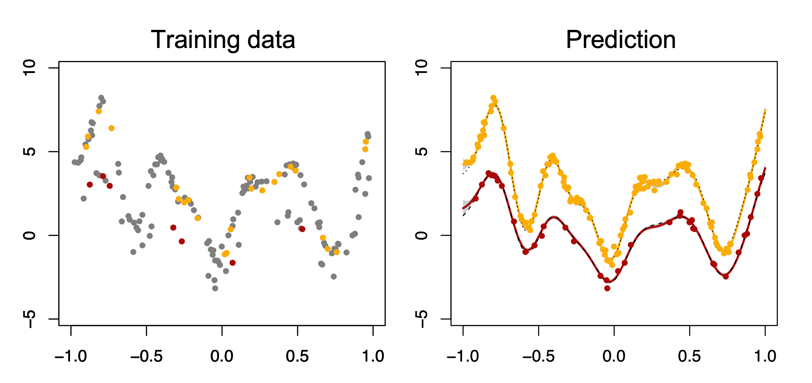

# Weakly Supervised Multi-output Regression via Correlated Gaussian Processes

This is a repository containing R code for the model _WSMGP_ proposed by the paper [Weakly-supervised Multi-output Regression via Correlated Gaussian Processes](https://pubsonline.informs.org/doi/10.1287/ijds.2022.0018) by [S. Chung](https://sites.google.com/site/schungkorea/), R. Kontar, and Z. Wu.

Multi-output regression seeks to estimate multiple unknown or latent functions for observations arising from a known number of outputs/groups. Relative to a separate regression for each group, multi-output regression is statistically appealing as it can borrow strength by exploiting potential between-group similarities resulting in improved learning and prediction accuracy. One fundamental assumption of classical multi-output regression is that the group labels of all observations are given. However, this assumption may not hold if label information is sensitive or expensive to obtain. 

We develop an approach to address the issue. Specifically, we build a Gaussian process (GP)-based probabilistic model for multi-output regression, providing improved prediction by leveraging both labeled and unlabeled observations, as well as correlation across groups. Please see the [paper](https://pubsonline.informs.org/doi/10.1287/ijds.2022.0018) for more details about the model and its application in healthcare. 


## Usage

Please run _sk_mixtureCorrGP.R_ to get results. 

The code generates observations of two correlated curves where the group membership labels for some observations are missing. Imbalance ratio and labeled fraction are set to 0.3 and 0.2, respectively. 

The code generates training data and implements WSMGP that estimates predictive mean and variance as follows:



When you use this code, please cite the paper as follows:
```
@article{chung2022weakly,
  title={Weakly Supervised Multi-output Regression via Correlated Gaussian Processes},
  author={Chung, Seokhyun and Al Kontar, Raed and Wu, Zhenke},
  journal={INFORMS Journal on Data Science},
  year={2022},
  publisher={INFORMS}
}
```
